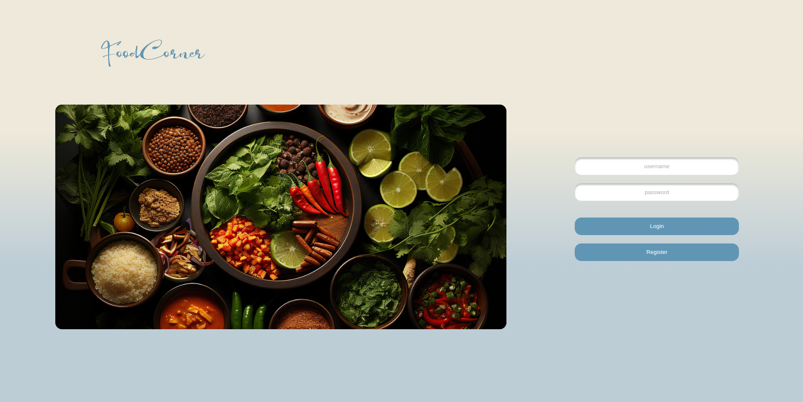

# WDPAI

## Table of content

* [About](#about)
* [Tech stack](#tech-stack)
    * [Database Schema](#database-schema)
* [Screenshots](#screenshots)

### About

Food Corner is a web application that allows users to add, search and like recipes. It also allows users to add their own recipes and share them with other users. The application is based on the MVC design pattern. The application is written in PHP and uses the PostgreSQL database. The application is run in a Docker container and can be run on any cloud platform supporting Docker or Kubernetes.

### Tech stack

+ Docker
+ PostgreSQL
+ PHP
+ HTML
+ CSS
+ JavaScript

#### Database Schema

### Screenshots

#### Login page

#### Register page

#### Home page

#### Add recipe page

